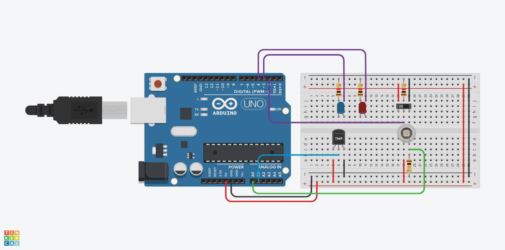
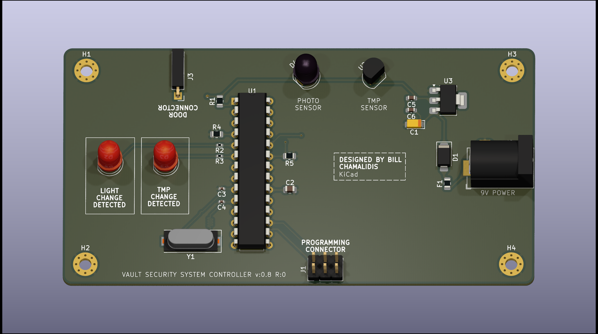
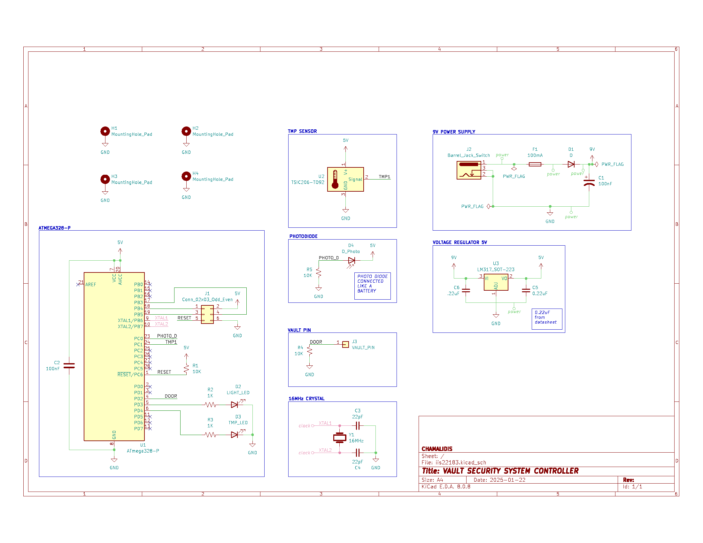

# Safe Security System

The Safe Security System monitors for changes in temperature and light while a safe is closed. If a minimum threshold is exceeded, the system notifies the owner only when the safe is opened normally.

This repository contains Kicad and Tinkercad files

<h2>About:</h2>

<b>Author: </b><a href="https://github.com/bill-chamal">Bill Chamalidis</a> University of Macedonia
